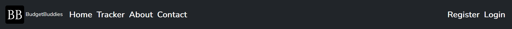
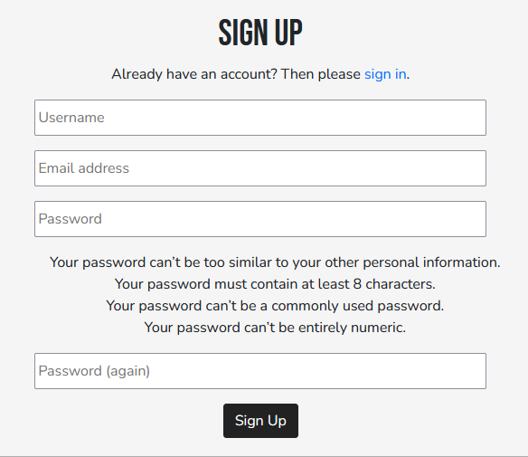
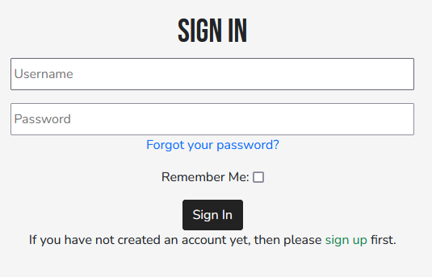
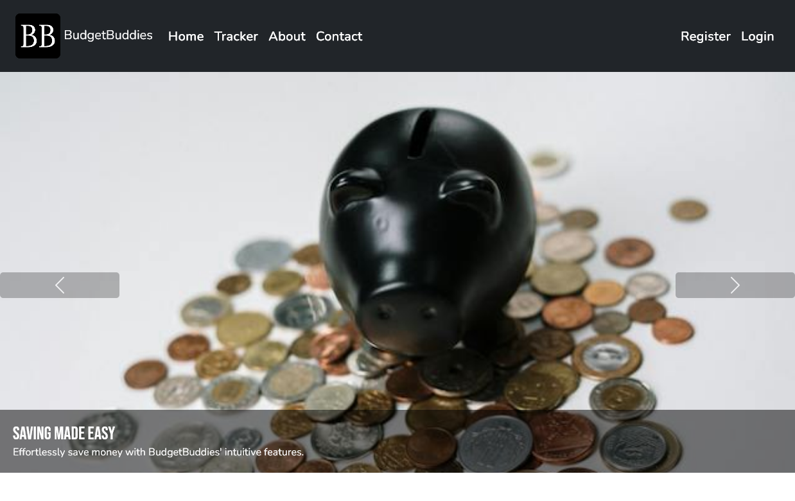
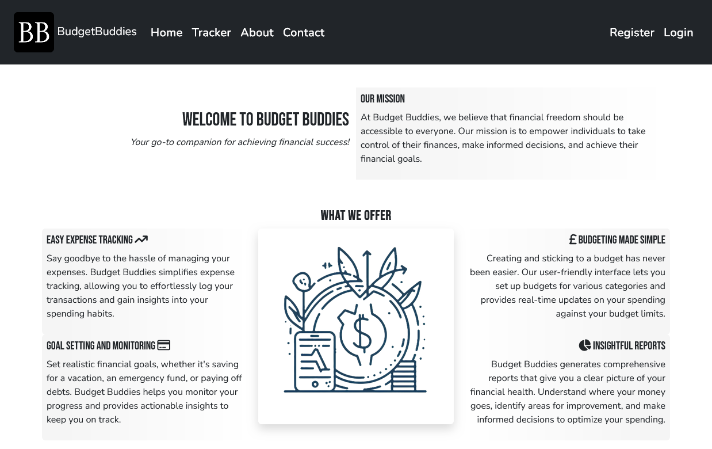
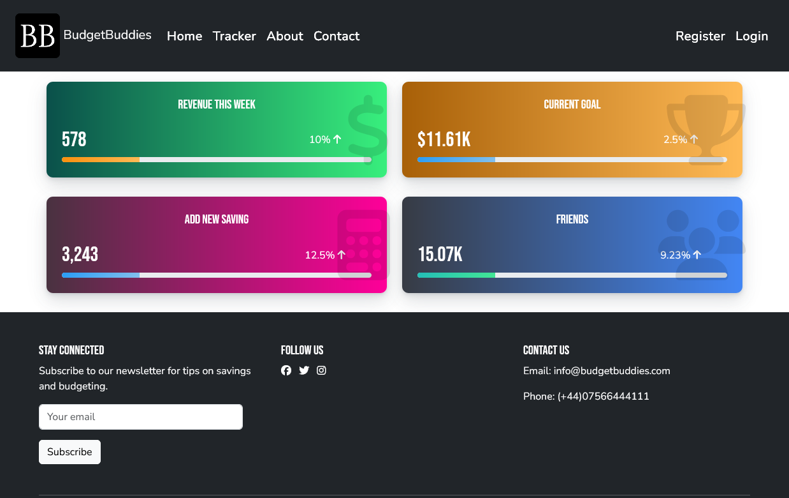
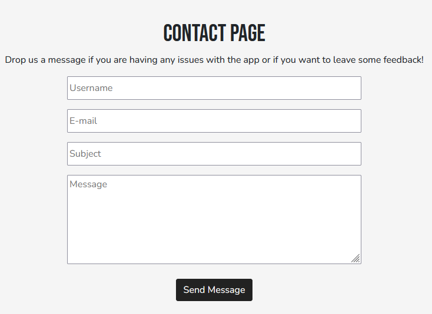
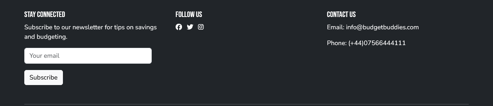

# Budget Buddies

Budget Buddies is your one stop shop to achieving savings goals, we provide a singular destination for you to add savings goals, track their progress, get tips to manage your finances and turn savings into a social experience! 

We want to make it simple and easy for you to benefit from the 50,30,20 savings technique. we want to colour code your needs, wants and savings into a handy chart so you can see where best to cut back and get those dreams!

  

## Features 

### Existing Features

- __Navigation Bar__

  - Made in Django This allows the user to access all areas of the website

  

- __Register and Login Pages__

  - The user can register to have an account they can use to store their data and access it later and any time on any device

  
  

- __Home/Landing Page__

  - The main page features a prominent hero carousel 
  - Below that is further information on what Budget Buddies do and why to register 

  

- __About Page__

  - This section shows Budget Buddies mission
  - This prominently displays all our features

  

- __Tracking__

  - This section allows the user to add a goal and keep it updated
  - This shows the users goals and how far along they have come to acheiving them

  

- __Contact__

  - A simple contact form using emailJS functionality that delivers a success or fail message to the user when they submit

  

- __The Footer__ 

  - The footer section includes links to the relevant social media sites for Budget Buddies. The links will open to a new tab to allow easy navigation for the user. 
  - The footer is valuable to the user as it encourages them to keep connected via social media

  

## Testing 

### Validator Testing 

- HTML
  - No errors were returned when passing through the official [W3C validator](https://validator.w3.org/nu/?doc=https%3A%2F%2Fcode-institute-org.github.io%2Flove-running-2.0%2Findex.html)
- CSS
  - No errors were found when passing through the official [(Jigsaw) validator](https://jigsaw.w3.org/css-validator/validator?uri=https%3A%2F%2Fvalidator.w3.org%2Fnu%2F%3Fdoc%3Dhttps%253A%252F%252Fcode-institute-org.github.io%252Flove-running-2.0%252Findex.html&profile=css3svg&usermedium=all&warning=1&vextwarning=&lang=en#css)

### Unfixed Bugs

You will need to mention unfixed bugs and why they were not fixed. This section should include shortcomings of the frameworks or technologies used. Although time can be a big variable to consider, paucity of time and difficulty understanding implementation is not a valid reason to leave bugs unfixed. 

## Deployment

- The site was deployed to Heroku app

The live link can be found [HERE](https://janhack-5dc055031240.herokuapp.com/)

# Technologies Used

## Languages

- [HTML](w3.org/standards/webdesign/htmlcss)
  - Page markup.
- [CSS](w3.org/standards/webdesign/htmlcss)
  - Styling.
- [Javascript](https://developer.mozilla.org/en-US/docs/Web/JavaScript)
  - Running functions for interactive components, AJAX, etc.

## Frameworks

- [Bootstrap 5](https://getbootstrap.com/)
  - Used for basic styles and outline.
- [Django](https://www.djangoproject.com/) 
  - Used to rapidly build the website with models

## Libraries

- [JQuery](https://jquery.com/)
  - Animations and click functions.
- [Google Fonts](https://fonts.google.com)
  - Font Styles.
- [Fontawesome](https://fontawesome.com/)
  - Used for icons

## APIs

- [EmailJS](https://www.emailjs.com/)
   - EmailAPI used for having a contact page with no backend

## Platforms

- [Github](https://github.com/)
  - Storing code remotely and deployment.  
- [Gitpod](https://gitpod.io/)
  - IDE for project development.

## Other Tools

- [Balsamiq](https://balsamiq.com/)
  - To create wireframes.

## Credits 

### Content 

- The text for the Home page was taken from Wikipedia Article A
- Instructions on how to implement form validation on the Sign Up page was taken from [Specific YouTube Tutorial](https://www.youtube.com/)
- The icons in the footer were taken from [Font Awesome](https://fontawesome.com/)

### Media

- Images were sourced from [Unsplash](https://unsplash.com/)
- AI images generated using [Microsoft Designer](https://designer.microsoft.com/)
